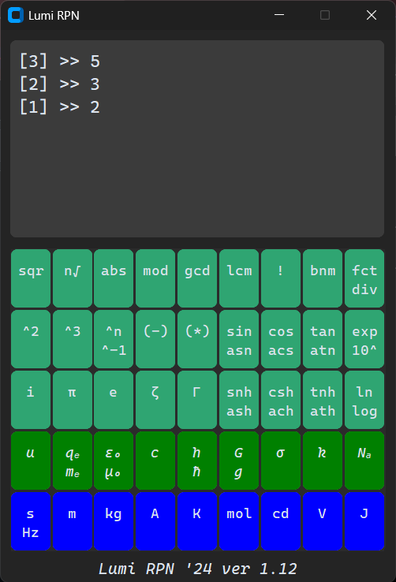

# Lumi RPN

**Lumi RPN** is a desktop Reverse Polish Notation (RPN) calculator for Windows, implemented in Python using `customtkinter`.
It is a stack-based scientific calculator with support for real and complex arithmetic, physical units, constants, number theory operations, and selected special functions.

The application is intentionally self-contained in a single source file and relies on explicit stack manipulation rather than expression parsing.

Below: Demo of the startup screen (l). Factorizing the number 30 (r).

<div style="display: flex; gap: 1em; align-items: flex-start;">
  
  
</div>

---

## Overview

* **Calculation model:** Reverse Polish Notation (stack-based)
* **UI framework:** `customtkinter` (Tkinter-compatible)
* **Target platform:** Windows (portable Python application)
* **Focus:** correctness, transparency of operations, unit consistency by strictly using SI-units

The calculator maintains:

* a **numeric stack** (as strings, evaluated lazily),
* a **parallel unit stack** tracking SI base units via integer exponent vectors.

---

## Dependencies

The project uses the following Python packages:

### UI

* **`customtkinter`**

  * Modern themed wrapper around Tkinter.
  * Used for all widgets (`CTk`, `CTkButton`, `CTkTextbox`, `CTkFrame`, `CTkLabel`).
  * Dark mode and color themes are configured at startup.

### Core Python

* **`math`**

  * Trigonometric, exponential, logarithmic, factorial, combinatorics, gamma.
* **`ast.literal_eval`**

  * Safe evaluation of numeric input (real and complex).
  * Prevents execution of arbitrary Python code.

### Symbolic / Number Theory

* **`sympy`**

  * `sympy.ntheory.factorint` for prime factorization.
  * `sympy.divisors` for divisor enumeration.

### Scientific Functions

* **`scipy.special`**

  * Riemann zeta function (`ζ`).

---

## Application Architecture

The entire application is built around a single entry point:

```python
def create_ui():
    ...
```

This function is responsible for:

* UI initialization
* State initialization (stacks, constants, operations)
* Event binding
* Main event loop

No global state is used outside this function.

---

## Stack Model

### Numeric Stack

* Implemented as a Python list of strings.
* Values are only evaluated using `literal_eval` at execution time.
* Supports:

  * integers
  * floats
  * scientific notation
  * complex numbers (`i` → `j` internally)

Example internal state:

```python
stack = ["3", "4", ""]
```

The empty string represents the current input buffer.

---

### Unit Stack

Each numeric stack entry has a corresponding unit vector:

```python
[s, m, kg, A, K, mol, cd]
```

Units are represented as integer exponent vectors, allowing:

* multiplication → exponent addition
* division → exponent subtraction
* powers and roots → exponent scaling

Example:

```python
m/s² → [ -2, 1, 0, 0, 0, 0, 0 ]
```

Unit consistency is enforced implicitly through these vector operations.

---

## Supported Operations

### Binary Operations (Stack → Stack)

Defined in `operations`:

* `+`, `-`, `*`, `/`
* exponentiation (`^`, `^n`)
* modulo (`mod`)
* roots (`n√`)
* combinatorics (`bnm`)
* number theory (`gcd`, `lcm`)

Operands are popped from the stack in RPN order:

```
x y op
```

---

### Unary Functions

Defined in `functions`:

* Trigonometric (`sin`, `cos`, `tan`)
* Hyperbolic (`snh`, `csh`, `tnh`)
* Inverse functions (`asn`, `acs`, `atn`, `ash`, `ach`, `ath`)
* Exponentials and logs (`exp`, `ln`, `log`, `10^`)
* Powers (`^2`, `^3`, `^-1`)
* Roots (`sqr`, `cbr`)
* Special functions (`Γ`, `ζ`)
* Complex conjugation (`(*)`)
* Absolute value, negation

Each function:

* pops one stack element,
* applies the operation,
* pushes the result back,
* updates units if applicable.

---

### Constants

Physical and mathematical constants are defined with explicit units:

Examples:

* π, e
* speed of light `c`
* Planck constants `h`, `ħ`
* gravitational constant `G`
* elementary charge `qₑ`
* vacuum constants `ε₀`, `μ₀`
* Avogadro constant `Nₐ`

Constants can be inserted either into an empty stack slot or pushed as new entries.

---

## Number Theory Tools

Special stack-expanding operations:

* **Factorization (`fct`)**

  * Pushes prime factors individually onto the stack.
* **Divisors (`div`)**

  * Pushes all divisors of a number.

These operations preserve the unit only on the final stack element.

---

## Input Methods

### Keyboard Input

Supported keys:

* digits `0–9`
* `e` (scientific notation)
* `+ - * /`
* `i` / `j` for complex numbers
* `Enter` → push value onto stack
* `Backspace` → delete last character / pop stack
* `Delete` → clear current entry
* `Escape` → clear entire stack

Keyboard input is processed through the same evaluation pipeline as buttons.

---

## Error Handling

* All evaluations are wrapped in `try/except`.
* On error:

  * stack state is restored,
  * error message is shown in the display,
  * application continues running.

No exceptions terminate the UI loop.

---

## Execution

Run directly with Python:

```bash
python lumi_rpn.py
```

Entry point:

```python
if __name__ == "__main__":
    create_ui()
```
---
